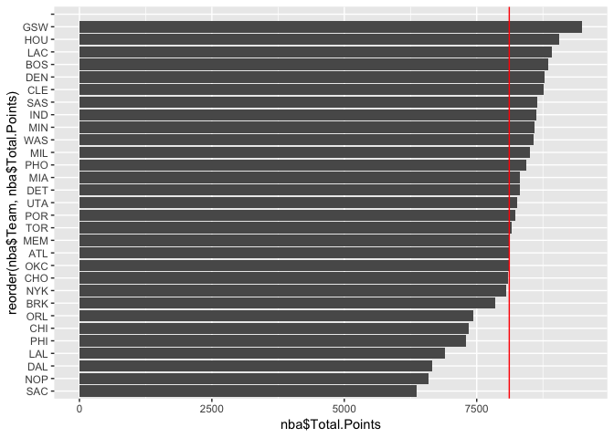

Stat 133 - Workout 1
================

``` r
nba <- read.csv('/Users/angelagao/Desktop/hw-stat133/workout1/data/nba-teams.csv')
nba
```

    ##       X Team Points3 Experience    Salary Points2 Points1 Total.Points
    ## 1     1  ATL     660   93.40559  93.40559    2337    1453         8107
    ## 2     2  BOS     985   91.91509  91.91509    2183    1536         8857
    ## 3     3  BRK     777   76.21567  76.21567    2040    1444         7855
    ## 4     4  CHI     565   92.50189  92.50189    2162    1330         7349
    ## 5     5  CHO     808   88.50477  88.50477    2089    1497         8099
    ## 6     6  CLE    1030  127.25458 127.25458    2148    1384         8770
    ## 7     7  DAL     712   92.82830  92.82830    1754    1007         6651
    ## 8     8  DEN     868   79.02822  79.02822    2351    1477         8783
    ## 9     9  DET     631  103.07449 103.07449    2638    1140         8309
    ## 10   10  GSW     982  100.24256 100.24256    2545    1455         9491
    ## 11   11  HOU    1140   87.39233  87.39233    2011    1623         9065
    ## 12   12  IND     709   92.62084  92.62084    2512    1467         8618
    ## 13   13  LAC     841  114.77662 114.77662    2401    1586         8911
    ## 14   14  LAL     582   85.12544  85.12544    2069    1021         6905
    ## 15   15  MEM     757  108.94584 108.94584    2176    1489         8112
    ## 16   16  MIA     799   72.94438  72.94438    2349    1217         8312
    ## 17   17  MIL     720  104.64657 104.64657    2462    1413         8497
    ## 18   18  MIN     599   59.87827  59.87827    2607    1580         8591
    ## 19   19  NOP     519   94.03547  94.03548    1956    1128         6597
    ## 20   20  NYK     636   97.10692  97.10692    2445    1262         8060
    ## 21   21  OKC     611   86.98136  86.98136    2380    1511         8104
    ## 22   22  ORL     618  104.11034 104.11034    2178    1232         7442
    ## 23   23  PHI     718   56.29336  56.29336    1960    1225         7299
    ## 24   24  PHO     569   73.28258  73.28258    2554    1615         8430
    ## 25   25  POR     847  102.48876 102.48876    2148    1386         8223
    ## 26   26  SAC     562   88.27720  88.27720    1838     998         6360
    ## 27   27  SAS     753  105.39553 105.39553    2469    1440         8637
    ## 28   28  TOR     626  108.45847 108.45847    2359    1570         8166
    ## 29   29  UTA     791   80.32319  80.32319    2242    1401         8258
    ## 30   30  WAS     718  100.78591 100.78591    2526    1368         8574
    ## 31 NULL           NA         NA        NA      NA      NA           NA
    ##    Offensive.Rebounds Defensive.Rebounds Assists Steals Blocks Turnovers
    ## 1                 832               2676    1846    645    381      1201
    ## 2                 744               2698    2069    617    340      1037
    ## 3                 689               2697    1664    568    382      1212
    ## 4                 865               2419    1746    605    339       956
    ## 5                 621               2615    1806    543    316       820
    ## 6                 735               2673    1779    483    304      1020
    ## 7                 521               2063    1183    507    257       674
    ## 8                 872               2660    2015    543    286      1102
    ## 9                 908               2838    1732    574    310       932
    ## 10                770               2869    2486    782    554      1179
    ## 11                857               2608    1969    617    331      1113
    ## 12                742               2702    1844    669    409      1087
    ## 13                738               2790    1848    612    347      1022
    ## 14                789               2213    1334    510    267       972
    ## 15                880               2582    1725    629    335       993
    ## 16                856               2648    1728    579    464      1019
    ## 17                723               2589    1984    666    436      1096
    ## 18                932               2516    1924    641    368      1085
    ## 19                580               2248    1531    502    380       828
    ## 20                962               2592    1499    526    451       975
    ## 21                936               2628    1610    595    395      1133
    ## 22                707               2452    1760    546    305       987
    ## 23                690               2354    1816    613    375      1197
    ## 24                882               2464    1531    588    385      1171
    ## 25                706               2428    1508    522    342       978
    ## 26                525               1876    1402    506    232       850
    ## 27                821               2777    1954    655    484      1057
    ## 28                847               2535    1469    620    379       932
    ## 29                771               2774    1651    550    410      1060
    ## 30                806               2564    1893    655    325      1062
    ## 31                 NA                 NA      NA     NA     NA        NA
    ##    Fouls Efficiency
    ## 1   1432   292.0341
    ## 2   1686   271.8135
    ## 3   1620   322.1206
    ## 4   1275   274.6417
    ## 5   1177   270.3153
    ## 6   1356   333.1867
    ## 7   1229   285.7272
    ## 8   1475   309.3403
    ## 9   1467   270.5206
    ## 10  1581   292.7862
    ## 11  1473   300.8000
    ## 12  1597   276.2583
    ## 13  1626   271.0821
    ## 14  1444   258.4660
    ## 15  1798   288.3657
    ## 16  1647   301.1723
    ## 17  1660   298.7987
    ## 18  1620   260.0745
    ## 19  1168   321.4073
    ## 20  1584   273.8031
    ## 21  1561   279.0951
    ## 22  1445   270.7099
    ## 23  1573   338.4627
    ## 24  1887   296.2003
    ## 25  1581   264.6656
    ## 26  1303   295.7526
    ## 27  1498   268.4383
    ## 28  1609   288.6523
    ## 29  1545   272.0748
    ## 30  1643   268.5099
    ## 31    NA         NA

``` r
a <-nba[rev(order(nba$Salary)),]
vars <- c("Team", "Salary")
a[vars]
```

    ##    Team    Salary
    ## 31             NA
    ## 6   CLE 127.25458
    ## 13  LAC 114.77662
    ## 15  MEM 108.94584
    ## 28  TOR 108.45847
    ## 27  SAS 105.39553
    ## 17  MIL 104.64657
    ## 22  ORL 104.11034
    ## 9   DET 103.07449
    ## 25  POR 102.48876
    ## 30  WAS 100.78591
    ## 10  GSW 100.24256
    ## 20  NYK  97.10692
    ## 19  NOP  94.03548
    ## 1   ATL  93.40559
    ## 7   DAL  92.82830
    ## 12  IND  92.62084
    ## 4   CHI  92.50189
    ## 2   BOS  91.91509
    ## 5   CHO  88.50477
    ## 26  SAC  88.27720
    ## 11  HOU  87.39233
    ## 21  OKC  86.98136
    ## 14  LAL  85.12544
    ## 29  UTA  80.32319
    ## 8   DEN  79.02822
    ## 3   BRK  76.21567
    ## 24  PHO  73.28258
    ## 16  MIA  72.94438
    ## 18  MIN  59.87827
    ## 23  PHI  56.29336

``` r
mean(nba$Salary[1:30])
```

    ## [1] 92.29469

``` r
library(ggplot2)
```

``` r
ggplot(a,aes(x= reorder(nba$Team,nba$Salary),nba$Salary))+geom_bar(stat ="identity") + coord_flip() + geom_hline(yintercept = 92.29469, col = "red")
```

    ## Warning: Removed 1 rows containing missing values (position_stack).


``` r
b <-nba[rev(order(nba$Total.Points)),]
vars <- c("Team", "Total.Points")
b[vars]
```

    ##    Team Total.Points
    ## 31                NA
    ## 10  GSW         9491
    ## 11  HOU         9065
    ## 13  LAC         8911
    ## 2   BOS         8857
    ## 8   DEN         8783
    ## 6   CLE         8770
    ## 27  SAS         8637
    ## 12  IND         8618
    ## 18  MIN         8591
    ## 30  WAS         8574
    ## 17  MIL         8497
    ## 24  PHO         8430
    ## 16  MIA         8312
    ## 9   DET         8309
    ## 29  UTA         8258
    ## 25  POR         8223
    ## 28  TOR         8166
    ## 15  MEM         8112
    ## 1   ATL         8107
    ## 21  OKC         8104
    ## 5   CHO         8099
    ## 20  NYK         8060
    ## 3   BRK         7855
    ## 22  ORL         7442
    ## 4   CHI         7349
    ## 23  PHI         7299
    ## 14  LAL         6905
    ## 7   DAL         6651
    ## 19  NOP         6597
    ## 26  SAC         6360

``` r
mean(nba$Total.Points[1:30])
```

    ## [1] 8114.4

``` r
ggplot(b,aes(x= reorder(nba$Team,nba$Total.Points),nba$Total.Points))+geom_bar(stat ="identity") + coord_flip() + geom_hline(yintercept = 8114.4, col = "red")
```

    ## Warning: Removed 1 rows containing missing values (position_stack).



``` r
c <-nba[rev(order(nba$Total.Points)),]
vars <- c("Team", "Total.Points")
c[vars]
```

    ##    Team Total.Points
    ## 31                NA
    ## 10  GSW         9491
    ## 11  HOU         9065
    ## 13  LAC         8911
    ## 2   BOS         8857
    ## 8   DEN         8783
    ## 6   CLE         8770
    ## 27  SAS         8637
    ## 12  IND         8618
    ## 18  MIN         8591
    ## 30  WAS         8574
    ## 17  MIL         8497
    ## 24  PHO         8430
    ## 16  MIA         8312
    ## 9   DET         8309
    ## 29  UTA         8258
    ## 25  POR         8223
    ## 28  TOR         8166
    ## 15  MEM         8112
    ## 1   ATL         8107
    ## 21  OKC         8104
    ## 5   CHO         8099
    ## 20  NYK         8060
    ## 3   BRK         7855
    ## 22  ORL         7442
    ## 4   CHI         7349
    ## 23  PHI         7299
    ## 14  LAL         6905
    ## 7   DAL         6651
    ## 19  NOP         6597
    ## 26  SAC         6360

``` r
mean(nba$Efficiency[1:30])
```

    ## [1] 287.1759

``` r
ggplot(c,aes(x= reorder(nba$Team,nba$Efficiency),nba$Efficiency))+geom_bar(stat ="identity") + coord_flip() + geom_hline(yintercept = 287.1759, col = "red")
```

    ## Warning: Removed 1 rows containing missing values (position_stack).


``` r
d <-nba[rev(order(nba$Efficiency)),]
vars <- c("Team", "Efficiency")
d[vars]
```

    ##    Team Efficiency
    ## 31              NA
    ## 23  PHI   338.4627
    ## 6   CLE   333.1867
    ## 3   BRK   322.1206
    ## 19  NOP   321.4073
    ## 8   DEN   309.3403
    ## 16  MIA   301.1723
    ## 11  HOU   300.8000
    ## 17  MIL   298.7987
    ## 24  PHO   296.2003
    ## 26  SAC   295.7526
    ## 10  GSW   292.7862
    ## 1   ATL   292.0341
    ## 28  TOR   288.6523
    ## 15  MEM   288.3657
    ## 7   DAL   285.7272
    ## 21  OKC   279.0951
    ## 12  IND   276.2583
    ## 4   CHI   274.6417
    ## 20  NYK   273.8031
    ## 29  UTA   272.0748
    ## 2   BOS   271.8135
    ## 13  LAC   271.0821
    ## 22  ORL   270.7099
    ## 9   DET   270.5206
    ## 5   CHO   270.3153
    ## 30  WAS   268.5099
    ## 27  SAS   268.4383
    ## 25  POR   264.6656
    ## 18  MIN   260.0745
    ## 14  LAL   258.4660

``` r
mean(nba$Efficiency[1:30])
```

    ## [1] 287.1759

``` r
ggplot(d,aes(x= reorder(nba$Team,nba$Efficiency),nba$Efficiency))+geom_bar(stat ="identity") + coord_flip() + geom_hline(yintercept = 287.1759, col = "red")
```

    ## Warning: Removed 1 rows containing missing values (position_stack).

 Defense shows how well their defense works at blocking and stealing the ball

``` r
nba$defense <- nba$Defensive.Rebounds + nba$Steals + nba$Blocks + nba$Turnovers
```

``` r
e <-nba[rev(order(nba$defense)),]
vars <- c("Team", "defense")
e[vars]
```

    ##    Team defense
    ## 31           NA
    ## 10  GSW    5384
    ## 27  SAS    4973
    ## 1   ATL    4903
    ## 12  IND    4867
    ## 3   BRK    4859
    ## 29  UTA    4794
    ## 17  MIL    4787
    ## 13  LAC    4771
    ## 21  OKC    4751
    ## 16  MIA    4710
    ## 2   BOS    4692
    ## 11  HOU    4669
    ## 9   DET    4654
    ## 18  MIN    4610
    ## 24  PHO    4608
    ## 30  WAS    4606
    ## 8   DEN    4591
    ## 20  NYK    4544
    ## 23  PHI    4539
    ## 15  MEM    4539
    ## 6   CLE    4480
    ## 28  TOR    4466
    ## 4   CHI    4319
    ## 5   CHO    4294
    ## 22  ORL    4290
    ## 25  POR    4270
    ## 14  LAL    3962
    ## 19  NOP    3958
    ## 7   DAL    3501
    ## 26  SAC    3464

``` r
mean(nba$defense[1:30])
```

    ## [1] 4528.5

``` r
ggplot(e,aes(x= reorder(nba$Team,nba$defense),nba$defense))+geom_bar(stat ="identity") + coord_flip() + geom_hline(yintercept = 4528.5, col = "red")
```

    ## Warning: Removed 1 rows containing missing values (position_stack).


It is my first time using file structure. It was helpful for organizing. THis is not my first time using relevant paths. They help locate files. This is my first time using script. I like the organization of chunks in R Markdown. It is still hard working with Github. It took me 3 hours to complete the assignment.
